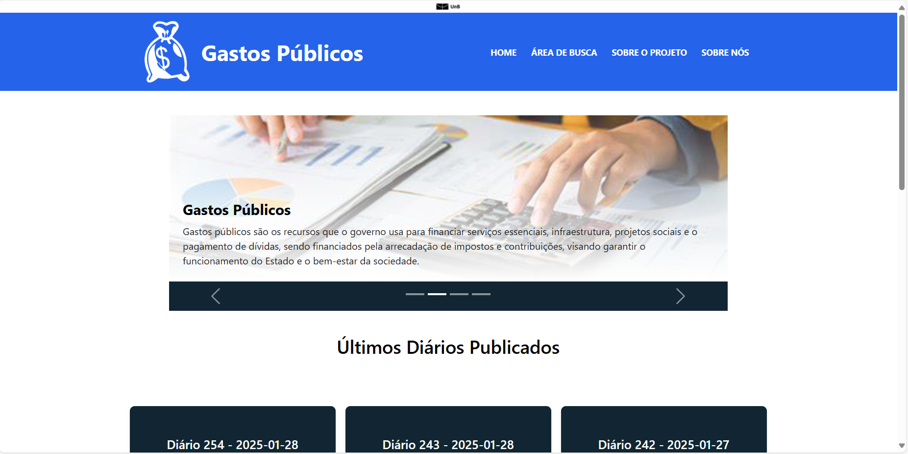
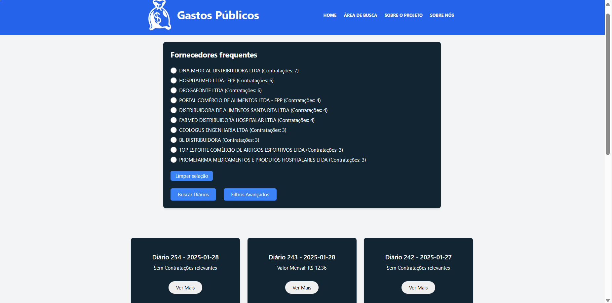

# 📊 Monitoramento de Gastos Públicos

Este projeto foi desenvolvido para a disciplina Métodos de Desenvolvimento de Software na Universidade de Brasília (UnB) durante o segundo semestre de 2024


[](./LICENSE)
[](https://img.shields.io/github/issues/unb-mds/2024-2-Squad06)
[](https://img.shields.io/github/contributors/unb-mds/2024-2-Squad06)
[](https://img.shields.io/github/stars/unb-mds/MOSP-G8)
</br>
[](https://www.python.org/downloads/release/python-3128/)
[](https://github.com/tailwindlabs/tailwindcss/releases/tag/v3.4.16)
[](https://reactjs.org/)
[](https://www.djangoproject.com/download/)
[](https://docs.docker.com/get-docker/)
[](https://www.typescriptlang.org/)


## 🗂️ Sumário

- [📜 Descrição do Projeto](#-descrição-do-projeto)
- [✔️ Funcionalidades](#-funcionalidades)
- [🛠️ Ferramentas Utilizadas](#️-ferramentas-utilizadas)
- [📋 Estrutura do Projeto](#-estrutura-do-projeto)
- [🚀 Como Executar o Projeto](#-como-executar-o-projeto)
- [📚 Documentação](#-documentação)
- [🤝 Como Contribuir](#-como-contribuir)
- [👥 Colaboradores](#-colaboradores)
- [📍 Licença](#-licença)

## 📜 Descrição do Projeto

_Monitoramento de Gastos Públicos_ é um projeto o qual fornecerá uma interface acessível para que cidadãos, estudantes e profissionais possam visualizar gastos e fornecedores nas contas do município de Maceió

## ✔️ Funcionalidades

Esta seção será atualizada com uma lista das principais funcionalidades do projeto em breve.

## 🛠️ Ferramentas Utilizadas

- **React e TailwindCSS**: Para a construção da estrutura e estilização das páginas web, garantindo uma interface visual atraente e responsiva.
- **Python**: Linguagem de programação utilizada para o desenvolvimento do backend e automações.
- **Django**: Framework utilizado para a criação do backend, gerenciamento de banco de dados e APIs REST.
- **Docker**: Plataforma de containerização utilizada para criar, gerenciar e implantar os serviços da aplicação de forma isolada, garantindo portabilidade, escalabilidade e consistência no ambiente de desenvolvimento e produção.
- **React com Typescript**: Biblioteca JavaScript, com suporte a typescript, utilizada para o desenvolvimento do frontend, oferecendo uma interface dinâmica e responsiva.
- **Querido Diário**: Biblioteca utilizada para a extração automatizada de dados dos diários oficiais de Maceió, AL, facilitando o acesso a informações sobre gastos públicos municipais.

## 📋 Estrutura do Projeto

```
root/
├──  client/
│   ├──  node_modules/
│   ├──  public/
│   ├──  src/
│   │   ├── components/
│   │   │   ├── Componentes do projeto
│   │   ├── hooks/
│   │   │   ├── Hooks personalizados do projeto
│   │   ├── pages/
│   │   │   ├── Páginas do projeto
│   │   ├── services/
│   │   │   ├── serviços para comunicação do front com o back
│   │   ├── App.css
│   │   ├── App.tsx
│   │   ├── index.css
│   │   ├── index.tsx
│   │   ├── setupTests.ts
│   │   └── react-app-env.d.ts
│   ├── Dockerfile
│   ├── tailwind.config.js
│   ├── tsconfig.json
│   ├── package.json
│   ├── .env
│   └── README.md
├──  server/
│   ├── apps/
│   │   ├── diarios/
│   │   │   ├── migrations/
│   │   │   │   ├── __init__.py
│   │   │   │   ├── 0001_initial.py
│   │   │   │   └── 0002_alter_diario_contratacoes.py
│   │   │   ├── admin.py
│   │   │   ├── apps.py
│   │   │   ├── models.py
│   │   │   ├── serializers.py
│   │   │   ├── services.py
│   │   │   ├── tests_controladores.py
│   │   │   ├── urls.py
│   │   │   ├── views.py
│   │   │   └── __init__.py
│   ├── server/
│   │   ├── __init__.py
│   │   ├── asgi.py
│   │   ├── settings.py
│   │   ├── urls.py
│   │   ├── wsgi.py
│   │   └── wsgi.py
│   ├── Dockerfile
│   ├── manage.py
│   ├── .env
│   └── requirements.txt
├── .gitignore
├── .dockerignore
├── .prettierrc
├── CODE_OF_CONDUCT.md
├── CONTRIBUTING.md
├── docker-compose.yml
├── LICENSE
├── README.md
└── SECURITY.md

```

## 🚀 Como Executar o Projeto

1. Crie na pasta `server/` o seguinte .env:

   ```
    - DB_NAME=YOUR_DB_NAME
    - DB_USER=YOUR_DB_USER
    - DB_PASSWORD=YOUR_DB_PASSWORD
    - DB_HOST=YOUR_DB_HOST
    - FRONTEND_URL=YOUR_FRONTEND_URL
   ```

2. Crie um .env na pasta `client/` desse jeito:

```.env
    REACT_APP_API_BASE_URL=YOUR_REACT_APP_API_BASE_URL
```

2. Execute o comando no seu terminal:

   ```
       docker-compose up --build -d
   ```

3. Quando terminar o processo acesse o frontend no link `http://localhost:3000/`, se possível espere até o backend poder receber conexões em torno de uns 20 segundos;

4. Acesse o servidor no `http://localhost:8000/`, teste por exemplo a rota: `http://localhost:8000/diarios/buscar/?query=licitacao&data_inicial=2024-01-01&data_final=2024-01-05`.

## 📚 Documentação

A documentação completa do projeto pode ser acessada [neste link](https://unb-mds.github.io/2024-2-Squad06/).\
A documentação sobre o guia de contribuição pode ser acessada [neste link](https://github.com/unb-mds/2024-2-Squad06/blob/main/CONTRIBUTING.md).\
A documentação sobre a licença pode ser acessada [neste link](https://github.com/unb-mds/2024-2-Squad06/blob/main/LICENSE).\
Link para vercel usado para a documentação de deploy pode ser acessada [neste link](https://vercel.com/docs/deployments/git/vercel-for-github).

## 🤝 Como Contribuir

Se você deseja colaborar com o projeto, siga as etapas abaixo:

1. **Faça um fork deste repositório** clicando no botão "Fork" no canto superior direito da página.

2. **Clone o repositório forkado** para a sua máquina:

   ```bash
   git clone https://github.com/unb-mds/2024-2-Squad06
   ```

3. **Crie uma branch** para realizar suas alterações:

   ```bash
   git checkout -b minha-feature
   ```

4. Faça as alterações desejadas no código e adicione os arquivos modificados ao controle de versão:

   ```bash
   git add .
   ```

5. Realize o commit das suas alterações:

   ```bash
   git commit -m "Descrição clara da feature ou correção"
   ```

6. Envie as alterações para o seu fork:

   ```bash
   git push origin minha-feature
   ```

7. **Abra um Pull Request** no repositório original.

### Regras para Colaboração

- Certifique-se de seguir as convenções de estilo do código adotadas no projeto.
- Adicione comentários claros para facilitar o entendimento do código.
- Teste suas alterações localmente antes de abrir o Pull Request.
- Inclua uma descrição detalhada no Pull Request, explicando as mudanças realizadas.

Caso tenha dúvidas, entre em contato com a equipe do projeto por meio das [issues](https://github.com/unb-mds/2024-2-Squad06/issues).

## Projeto 


<br/><br/>


## 👥 Colaboradores

<center>
<table style="margin-left: auto; margin-right: auto;">
    <tr>
        <td align="center">
            <a href="https://github.com/Neoprot">
                
                <h5 class="text-center">Kauã<br>Seichi</h5>
            </a>
        </td>
        <td align="center">
            <a href="https://github.com/TiagoTeixeira-2005">
                
                <h5 class="text-center">Tiago<br>Lemes</h5>
            </a>
        </td>
        <td align="center">
            <a href="https://github.com/Ana-Luiza-SC">
                
                <h5 class="text-center">Ana<br>Luiza</h5>
            </a>
        </td>
        <td align="center">
            <a href="https://github.com/ArthurGuilher62">
                
                <h5 class="text-center">Arthur<br>Guilherme</h5>
            </a>
        </td>
        <td align="center">
            <a href="https://github.com/NayraNery127">
                
                <h5 class="text-center">Nayra</h5>
            </a>
        </td>
         <td align="center">
            <a href="https://github.com/alvesingrid">
                
                <h5 class="text-center">Ingrid<br>Alves</h5>
            </a>
        </td>
</table>
</center>

## 📍 Licença

Este projeto está licenciado sob a [Licença MIT](https://github.com/unb-mds/2024-2-Squad06/blob/main/LICENSE).
