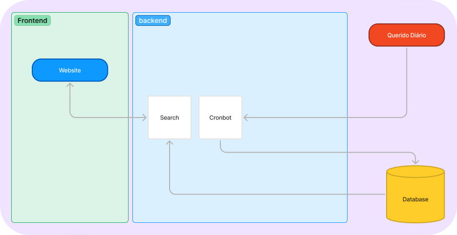

---
hide:
  - navigation
---

# Arquitetura

## Introdução
O projeto de **Monitoramento de Gastos Públicos** tem como objetivo coletar dados da API do 'Querido Diário' sobre os gastos do município de Maceió e organizá-los de forma que o usuário possa filtrar as informações conforme seu interesse. Além disso, o sistema permitirá a visualização dos dados dos fornecedores, dos valores, da vigência, da data de assinatura e da data de publicação.

## Diagrama da Arquitetura

## Visão Geral
A arquitetura do sistema é dividida em duas aplicações: o backend e o frontend.

### Backend

O backend é responsável por fornecer uma API REST, que oferece as seguintes funcionalidades:

- **Coleta de Dados**: Responsável por coletar as informações relevantes sobre os gastos públicos, fornecedores e datas e armazená-las no banco de dados.

- **Cronbot**: Responsável por automatizar a execução do processo de coleta de dados em intervalos programados, garantindo atualizações periódicas sem a necessidade de intervenção manual.

- **Banco de Dados**: O banco de dados é responsável por armazenar os dados coletados e processados pelo sistema. Ele garante que as informações sobre os gastos públicos, fornecedores e municípios sejam armazenadas de forma segura, organizada e eficiente, permitindo acessos rápidos para consultas futuras.

### Frontend

O frontend é responsável por consumir os dados disponibilizados pelo banco de dados e apresentar as informações para o usuário. O fluxo da aplicação se dá da seguinte forma:

1. **Acesso ao site**: Ao acessar o site do Monitoramento de Gastos Públicos, o usuário é apresentado com uma funcionalidade de pesquisa de gastos públicos.
2. **Busca por fornecedor**: O usuário pode realizar a busca pelo fornecedor desejado, inserindo o nome na barra de pesquisa.
3. **Filtragem de dados**: O usuário pode filtrar os gastos por valor mensal, data de assinatura e data de publicação.
4. **Visualização dos gastos**: Após aplicar os filtros, o usuário poderá visualizar os dados detalhados sobre os gastos.

## Fluxo de Trabalho

O fluxo de trabalho do projeto pode ser representado da seguinte maneira:

1. **Coleta de Dados**: O CronBot realiza a raspagem de dados diretamente da API do “Querido Diário”, extraindo as informações relevantes sobre os gastos públicos.
2. **Processamento e Organização**: Os dados coletados são processados e organizados de forma que se tornem acessíveis e estruturados, permitindo a consulta por município, setor ou fornecedor.
3. **Armazenamento**: Os dados processados e organizados são armazenados de maneira eficiente e segura no banco de dados, garantindo acessos rápidos e ordenados.
4. **Visualização**: Os dados organizados serão disponibilizados em nosso site.

## Tecnologias Utilizadas 

| Tecnologia    | Versão   |
|---------------|----------|
| Django        | 4.1.13   |
| Docker        | 27.4.0   |
| Python        | 3.12.8   |
| React         | 18.2.0   |
| Tailwind      | 3.4.16   |
| Typescript    | 3.4.5    |